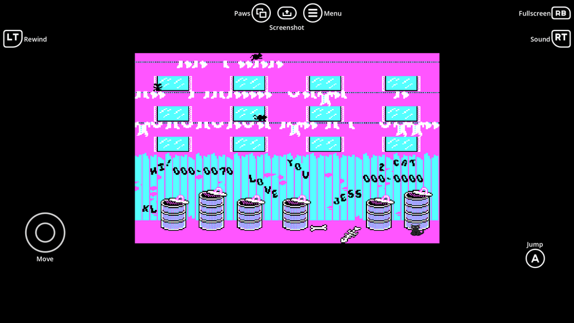

# godot-alleycat-gdextension

Alley Cat (1984) running inside Godot 4.8 as a GDExtension, built on
[PureAlleyCat](https://github.com/kirbycope/PureAlleyCat). Open the project and press Play.

The `AlleyCat` node is a `TextureRect` that runs the game and shows its 320x200 screen as its own
texture, so it drops into any scene, scales, and can live inside a `SubViewport` like any other
control.

```gdscript
@onready var game: AlleyCat = $Screen/Game

func _ready() -> void:
    game.loaded.connect(func(): print("running"))
    game.load_failed.connect(func(reason): push_warning(reason))
```

## The game

`addons/godot_alleycat_gdextension/assets/CAT.EXE` is the whole of Alley Cat: 55 KB holding the code
*and* all 29 KB of the artwork, so it is the only asset the addon needs. It is committed here, which
is why the demo and the web export both just run.

Alley Cat was written by Bill Williams and published by Synapse Software and IBM in 1984. It is
long out of print and circulates freely as abandonware, but it has never been placed in the public
domain and the copyright has not lapsed. Point `exe_path` somewhere else if you would rather supply
your own copy; the node reports a missing file on screen rather than failing silently.

## The node

| Property | |
| --- | --- |
| `exe_path` | where to find `CAT.EXE` |
| `autostart` | load and run on `_ready` |
| `speed` | multiplier on the game clock, 0.1 to 4.0 |
| `joystick` | tell the game a game adapter is fitted, so its joystick question can be answered yes |

| Method | |
| --- | --- |
| `load_game()` | read `exe_path` and reset; emits `loaded` or `load_failed(reason)` |
| `start()`, `stop()` | run or pause |
| `is_running()`, `is_loaded()`, `is_ready()` | state; `is_ready` is true once a video mode is set |
| `get_frame()` | the current frame as an `Image` |
| `get_joystick_state()` | what the pad is telling the game port: `x`, `y`, `button_1`, `button_2` |
| `get_instructions()`, `get_status()` | diagnostics |

## What the game answers to

Cursor keys move, Alt acts, Ctrl-S toggles sound, Ctrl-R restarts, Ctrl-M returns to the menu and Esc
pauses. Those are the game's own, printed on its own setup screen, and the node feeds them as
scancodes through the INT 9 handler the game installs for itself.

A joystick works too, and the game's own question about it has a real answer. Alley Cat asks "Do you
want to use a joystick (Y/N)?", checks the BIOS equipment list for a game adapter, and then times the
one-shots on port 0x201 the way an IBM PC game port behaves. PureAlleyCat emulates all of that, and
the node drives the port from the same four directions and from Alt, which is the game's action key
and its joystick button at once. The game reads the port or the keyboard depending on how its
question was answered, never both, so feeding both costs nothing and works either way round.

Set `joystick` to `false` to have the game report no adapter at all, which is the keyboard-only
machine.

The setup questions are the ones to plan for. The game asks them in text and will not go on until
they are answered, so Y, N and the four skill letters each need something to press them; on a pad
that means six buttons, not one button that guesses.

## Input is InputMap actions, and nothing else

The node reads the InputMap. It listens for the actions below and has no opinion about which key or
button fires them; nothing else reaches the game.

| Action | What the game gets |
| --- | --- |
| `alleycat_up` `alleycat_down` `alleycat_left` `alleycat_right` | the arrow keys, and the game port's two axes |
| `alleycat_alt` | Alt, the action key, and the game port's button |
| `alleycat_button_2` | the port's second button, which the game never reads |
| `alleycat_esc` | Esc, paws mode |
| `alleycat_sound` `alleycat_restart` `alleycat_menu` | Ctrl-S, Ctrl-R and Ctrl-M |
| `alleycat_yes` `alleycat_no` | Y and N, the joystick question |
| `alleycat_kitten` `alleycat_house_cat` `alleycat_tomcat` `alleycat_alley_cat` | K, H, T and A, the skill menu |

`AlleyCat.get_expected_inputs()` returns that list at runtime and
`get_missing_inputs()` returns the ones nothing has registered, so a host can say what is unbound
rather than leaving the player with a game that ignores them.

**Nothing is bound for you.** A project registers these actions itself, or installs the controls
addon and lets it do it. That is the whole contract: bind `alleycat_up` to whatever you like and the
cat walks.

```gdscript
InputMap.add_action("alleycat_up")
var event := InputEventKey.new()
event.physical_keycode = KEY_W
InputMap.action_add_event("alleycat_up", event)
```

## The HUD

The demo's on-screen controls are [godot-controls](https://github.com/kirbycope/godot-controls)
itself, instanced in `demo.tscn` as `Controls`, and because the game reads actions the HUD **is** the
mapping rather than a picture of one. Change a slot and you change what the button does.

Open [alley_cat_controls.tscn](./scenes/alley_cat_controls.tscn), which inherits the addon's
`controls.tscn`, and every slot is an inspector field. Its `input_catalog` is
[alley_cat_inputs.tres](./resources/alley_cat_inputs.tres), a copy of the list above, so each
`action_*` is a dropdown of the actions the game actually reads and a slot cannot name something
that will never arrive. A slot left blank is a button this game does not use, and the addon hides it.

[alley_cat_controls.gd](./scripts/alley_cat_controls.gd) subclasses the addon's `Controls` and adds
two things: the keyboard key behind each action, so the HUD's keyboard art names the key the game
answers to and lights up when it is pressed, and the words for the setup questions, which the same
buttons answer differently. `set_setting_up` swaps them with the addon's own `set_labels` and
`reset_labels`.

Every button on the HUD does exactly the one thing drawn on it, which took some deciding. The stick
and the arrow keys move the cat. The d-pad and the K, H, T and A keys are the skill menu, because the
game asks that in text and a pad has no letters, so those four answers need a home and the d-pad is
the only cluster free to be one - it deliberately does not double as a second way to walk, or the
player is shown two identical d-pads and one of them is lying. The face buttons are Alt, Sound, No
and Yes; Esc and Ctrl-M sit above. The shoulders, the triggers and the right stick are blank, and the
addon hides a blank slot.

The keyboard art names Alley Cat's own keys throughout rather than the addon's defaults, one
`keyboard_mouse_*` texture per slot set in the inherited scene, so a key drawn on the HUD is a key
the game answers to.

## Tests

```bash
godot --headless --audio-driver Dummy --path . -s addons/gut/gut_cmdln.gd -gdir=res://addons/godot_alleycat_gdextension/tests -gexit
```

Two suites, and both drive the real thing rather than asserting against a table.
`test_alley_cat.gd` sends actual joypad and key events and asks the node and the game what happened;
the pad answering the setup questions and starting play is one test end to end. `test_demo.gd`
opens the demo scene and checks the wiring: every slot mapped, every action it names registered,
the labels the scene carries, and the HUD following the game between its setup screen and play.

`get_joystick_state()` is what makes the mapping assertable without reading pixels, which is the
only other way to tell a stick pushed left from one that went nowhere.

One machine exists per process, so only one `AlleyCat` node can run at a time. That is a property
of the library, not of the node.

## Building

The built libraries in `addons/godot_alleycat_gdextension/bin/` are committed, so installing the
addon needs no toolchain. To rebuild:

```bash
git clone https://github.com/godotengine/godot-cpp.git      # not vendored
godot --headless --dump-extension-api                        # see below
scons platform=windows target=template_debug custom_api_file=extension_api.json
scons platform=windows target=template_release custom_api_file=extension_api.json
scons platform=macos   target=template_debug custom_api_file=extension_api.json
scons platform=macos   target=template_release custom_api_file=extension_api.json
scons platform=web threads=no target=template_release custom_api_file=extension_api.json
```

The macOS builds are universal binaries and must be made on a Mac, against an API dumped from that
machine's own Godot. The web build needs the Emscripten SDK on `PATH`, and `threads=no` because the
export preset sets `variant/thread_support=false`; a library built with threads will not load into a
single-threaded export, and vice versa.

`custom_api_file` is needed because godot-cpp's master ships `extension_api` files only up to 4.7,
and this targets 4.8. Dump the API from the engine build you actually run and the bindings match
it; without that the extension loads against the wrong ABI.

## The web demo

`.github/workflows/pages.yml` exports the demo and hands it to Pages on every push to `main`. To
build it here instead:

```bash
godot --headless --path . --import      # a few times; the controls addon brings hundreds of SVGs
godot --headless --path . --export-release "Web" build/index.html
python -m http.server --directory build
```

The export is single-threaded, so a plain static server is enough; no cross-origin isolation headers
are needed.

`CAT.EXE` is committed, so CI exports a playable build with no extra setup. The export preset names
it in `include_filter` explicitly, because Godot has no importer for a DOS executable and would
otherwise leave it out of the pack. A GitHub Pages site is public even when the repository is
private, so the deployed demo is a public copy of the game.

## Layout

| Path | |
| --- | --- |
| `src/alley_cat.{h,cpp}` | the node |
| `src/alley_cat_impl.c` | the one unit that defines `ALLEYCAT_IMPLEMENTATION` |
| `src/register_types.{h,cpp}` | GDExtension entry point |
| `addons/.../thirdparty/PureAlleyCat.h` | the library, vendored |
| `addons/.../scenes/demo/` | the demo scene |
| `addons/.../scenes/alley_cat_controls.tscn` | the HUD mapping, inherited from godot-controls |
| `addons/.../scripts/alley_cat_controls.gd` | the `Controls` subclass behind it |
| `addons/.../tests/` | GUT tests |
| `tools/addons.json` | what `pull_addons.py` fetches into `addons/` |

## Looks

`F6` cycles twenty-one ways of showing the same four colours. They are one shader with a mode rather than
twenty shaders, because all of them start from the CGA palette index rather than the RGB it arrives
as - which is what makes a recolour exact instead of a hue rotation guessing at what was meant.

| | | | |
| --- | --- | --- | --- |
| CGA | Amber CRT | Green CRT | Trinitron CRT |
| Comic | Cel | Game Boy | Paper |
| VHS | Pen and Ink | Dither | Negative |
| Deep Fried | Double Vision | Nausea | Holofoil |
| Film | Frost | Squiggle | Blueprint |
| Championship | | | |

`Left Trigger` (or `Backspace`) rewinds while held. Snapshots are whole copies of the machine taken
at the game's own 18.2 Hz, kept in a ring sized by the node's `rewind_seconds`; set it to zero to
turn rewind off and free the memory, which is what a web export wants.

Four of the looks are reimplementations of techniques published on
[godotshaders.com](https://godotshaders.com), all of them CC0, and none of the original code is
copied here - the source is 320x200 in four colours and wanted its own treatment:

| Look | After | Licence |
| --- | --- | --- |
| VHS | [VHS Tape Effect](https://godotshaders.com/shader/vhs-tape-effect/) by blblblblb | CC0 |
| Pen and Ink | [Simplified Hand-drawn Hatch Lines](https://godotshaders.com/shader/simplified-hand-drawn-hatch-lines/) by misha.cilantro | CC0 |
| Holofoil | [MemeHoloFoil](https://godotshaders.com/shader/memeholofoil-parody-holographic-card-foil/) | CC0 |
| Dither | [Classic dithering shader](https://godotshaders.com/shader/classic-dithering-shader/) | CC0 |

`Championship` is the odd one out: it is not after a shader but after a game. Pac-Man Championship
Edition redrew a 1980 maze as tubes of light on black, and Alley Cat suits the same treatment because
its artwork is black line work - outlines, the writing on the fence, the sprites - over two flat
fills. So the ink lights up, the fills go almost out, and the light spills, which is the half of that
look people leave out.

It also answers to the game rather than to a clock, which needs three things the shader cannot know,
because a shader is handed one frame with no memory of the last.

A lit region follows whatever is moving. The host samples every fourth pixel each way, diffs against
the previous frame and splits what changed into two centroids, so the light finds the cat and
whatever is chasing it without being told which is which.

The stage colour drifts with how busy the alley is. `get_effect_starts()` counts the sounds the game
has begun that were not the music, and each one nudges the hue a little. It has to be a count: the
voice that is sounding is a level, and a level that is already EFFECTS says nothing when the next
effect starts. That is why the colour used to change once and then never again.

And the colour jumps, with a wipe down the screen, whenever the game draws a different picture -
through a window into a room, back out into the alley, a life lost, a level begun.
`get_video_writes()` counts bytes drawn into the CGA window, and the size alone tells those apart:
measured in play, moving the cat and the mice costs about 120 bytes in a busy frame, while every
screen change costs the whole 16K at once. Pixels cannot answer this. Alley Cat's screens share a
background colour, so two completely different places agree on most of their pixels, and a new screen
arrives over several frames rather than in one, so a frame-to-frame difference never spikes either.

## Reading the machine

Alley Cat is one hand-written 1984 assembly program, so its variables sit at fixed addresses and what it
knows about itself is in memory at a place that does not move between runs. `peek(at, length)`, `peek_u8`
and `peek_u16` read it, and `get_load_address()` says where the image was put, so an offset into `CAT.EXE`
becomes an address here.

Finding *which* address is the harder half, and a plain differential scan is not enough on its own: taking a
snapshot before and after a life is lost turns up hundreds of bytes that happened to fall by one, almost all
of them animation timers. What works is asking the game where its code is.

`watch(from, to)` remembers the routines that write into a range of memory, and `get_watch_writers()` gives
them back as offsets into `CAT.EXE`, which line up with a disassembly of the file. Point it at the few bytes
of screen something is drawn in, let the game draw, and the drawing code names itself. Pointed at the band
the score is drawn across while a game starts, it comes back with five addresses inside 200 bytes of each
other; pointed at the middle of the picture while the cat walks, it comes back with three of the same ones.
Those are the game's sprite blitters:

| Routine | What it does |
| --- | --- |
| `sub_09FCD` | `rep movsw` straight into the screen: the plain blit |
| `sub_09F65` | reads the background first, saves it at `[bp]`, then ANDs the sprite over it |
| `sub_09FA0` | a blit that walks its source by a stride, for a taller strip |

They write the CGA window the way the hardware wants it - 80 bytes a row, even rows at `0xB8000` and odd
rows `0x2000` further on, `xor di, 0x2000` to change bank - which is why the picture cannot simply be
scaled: the artwork is 2 bits a pixel, interleaved by parity.

That is the hook hi-res art needs. It is also how the score was found.

`get_watch_callers()` answers the other half of the question. Every sprite in the game goes through those
same few blitters, so the writer says *how* something was drawn and only the caller says *what*: Alley Cat's
blitters are reached by a near call and push nothing, so the return address is still on top of the stack
when the store happens, and one word at `SS:SP` is the caller. Watching the score's band while a game starts
named `sub_09969`, and the disassembly explains it at once - it reads a digit through `BX`, shifts it by four
to index a glyph table at `0x2720`, blits it, and does that seven times with an extra column skipped after
the third. That is `000-0000`. Its two callers hand it the two numbers:

| | Offset | Drawn at |
| --- | --- | --- |
| Lives | `0x1f80` | screen `0x1260` |
| Lives last drawn | `0x1f81` | - |
| Score | `0x1f82` | screen `0x143c` |
| High score | `0x1f89` | screen `0x12ca` |

The lives came from the same reading. `sub_098E3` compares `0x1f80` against `0x1f81` and only draws when
they differ, so the first is the count and the second is a note of what is already on the fence - which is
why writing the count alone makes the game repaint it. `sub_098C0` confirms the two scores independently:
it walks the seven digits at `0x1f82` against those at `0x1f89` and copies one over the other when the game
has been won well enough.

Seven bytes each, one decimal digit per byte, most significant first - which is why a scan for a number
never found them, and why `sub_09936` adds to the score with `aaa`, the 8086's decimal adjust.

Those offsets are counted from `get_data_address()`, not from `get_load_address()`. Alley Cat's data segment
is a page above where the image was loaded, so an offset taken straight off the disassembly and added to the
load address reads rubbish. `peek` and `poke` work in physical addresses, and the sum of the two is one.

## Watching the game draw

Hi-res artwork over a 1984 game needs to know what was drawn and where, and the game will say so. Set
`reports_sprites` and `get_sprites()` gives back everything drawn in the last frame, in the order it was
drawn:

| | |
| --- | --- |
| `source` | the address the artwork was copied from, which `peek` can read |
| `x`, `y` | where it went, in the 320x200 picture |
| `width`, `height` | how big, in pixels |
| `masked` | whether it was ANDed over the background or painted straight on |

It costs nothing while it is off, and very little while it is on: the check is on the call instruction, which
is rare next to the millions of ordinary instructions a second the interpreter runs.

`at` is also there, as the raw offset into the CGA window, but `x` and `y` are what a host wants. That window
is not a bitmap: rows alternate between two banks `0x2000` apart and each byte is four pixels, because that
is what the hardware wanted rather than anything anyone would choose.

Measured in play, a busy frame draws four sprites, all from one address, which is the mice running along the
ground - one piece of artwork used four times, which is exactly what a host replacing it needs to know. The
attract screen draws one, the cat walking the fence.

The report is cleared at the start of every frame, so a quiet frame says nothing and a host should read it
every frame rather than whenever it happens to look.

## Putting your own artwork in

`AlleyCatArt` draws replacement pictures over the game's own sprites, sprite for sprite. It listens to
`get_sprites()` rather than trying to recognise anything in the picture: each frame it asks what was drawn
and, for anything it has a replacement for, paints over the top in the same place and at the same size.

The artwork is a resource - `AlleyCatArtwork`, a list of `AlleyCatSprite`, each pairing a source address
with a texture - so a set is a file that can be swapped whole, and anything not named in it is left exactly
as the game drew it. A set can be finished one sprite at a time.

`resources/artwork.tres` has a slot for **every** sprite the game was seen to draw - 134 of them - and each
one carries the game's own picture in `original`. That is what makes the thing usable: an address is not a
name, and nobody can draw a replacement for a sprite they cannot look at. Open the resource, scroll to a
sprite, see what it is, drop a texture into its `texture` and that sprite is replaced and nothing else.

Every slot ships empty except one, so out of the box the game looks exactly as it shipped. The example is
the cat at `0x11380`.

Two things the catalogue records are worth reading before drawing anything. `draws` says how often the
sprite was drawn, which separates the cat and the scenery from the rarities. And where `masked_draws` is
most of `draws`, that artwork is a *mask* - a solid shape ANDed into the background to punch a hole for a
sprite - rather than a picture, so replacing it paints over the hole rather than over a drawing.

Rebuilding the catalogue, when a new screen turns up sprites nobody has seen:

```bash
# with the demo running and reports_sprites on, save the catalogue from the game, then
python tools/export_sprites.py <catalogue.json>      # CAT.EXE -> assets/artwork/original/*.png
python tools/build_artwork_resource.py               # -> resources/artwork.tres
```

`export_sprites.py` reads the artwork straight out of `CAT.EXE`: the image was loaded at `0x10000` and the
file has a 512 byte header, so a sprite's bytes are at `(source - 0x10000) + 512`. CGA mode 4 packs four
pixels to a byte, two bits each, and index 0 is the background, which is written out transparent.

What it buys is resolution, not position: the replacement is drawn where the original was and at the same
size, so the game plays exactly as it did. The game's own sprite is eight pixels by five, or thirty-two by
fifteen, scaled up to whatever the window is; the replacement is drawn at the screen's resolution instead.

One thing worth knowing if you write something else against `get_sprites()`. The report is cleared on the
game's own tick, about eighteen times a second, not on the host's frame. A tick is tens of thousands of
instructions and the host asks for a few hundred at a time, so one tick's drawing is spread across dozens of
frames - clearing per frame hands back a fragment of a tick, and anything drawing from it flickers on for
one frame in twenty-odd, which reads as not working at all.

## Keeping a high score

The remaster node carries the high score across runs, which the game cannot do for itself: it was written
for a machine that was switched off at the wall. The saved digits are put into memory once, as soon as the
machine is up, and from then on it only reads - whenever the game's own high score beats what is on disk,
`user://alley_cat_high_score.txt` is rewritten. The file is the seven digits as text, so it can be read and
edited by a person. `get_score()` and `get_high_score()` give either as an ordinary number.

Nothing else writes to the game. A run in progress is never reached into.

## Losing a life

The wipe down the screen belongs to a death, and now says so. It used to be inferred from how much of the
screen was redrawn, which could not tell a life lost from a level begun because both replace the picture.
The game keeps the count itself, so it is read instead.

One honest wart. Polled every frame, `0x1f80` does not hold still: the true count and zero come back
alternately, 122 times across three real deaths in one measured game. The game's own code writes only a 3, a
9 and a decrement, so the zero is not something it means, and it is not the data segment moving either -
that was checked and it does not. It is unexplained. Rather than build on a reading that is not understood,
the count has to hold steady for `LIVES_STEADY_TIME` before it is believed, which steps over the flicker
completely: the same measured game reported 9, 3, 2, 1, 9 and fired exactly three wipes for three deaths.

## The remaster layer

`scenes/alley_cat_remaster.tscn` is one node to drop into a scene. Point its `game` at the [AlleyCat]
node, hand it a list of `looks`, and it takes `Esc` - Alley Cat's own paws key - before the game sees
it and puts its own menu up instead.

It does not try to detect the game's paws mode, and does not need to. A host that owns the key can
simply stop running the machine, which is a truer pause than the game's own: Alley Cat has no idea it
happened, so it has no opinions about what the player may do next. Rewind already works the same way.
Everything the menu changes - the look, the two volumes, how much rewind to keep - belongs to the
host, so a snapshot taken before the menu is still good after it.

The key is polled rather than listened for, because the HUD's own pause button is a
`TouchScreenButton` and those press their action straight into the input state without ever sending
an event. Polling catches the key, the pad and the on-screen button through one path - the same
reason the library polls its own inputs.

### Sound

The game drives one speaker from two places: a music player walking a note table, and the routines
that make its effects. Because there is only one speaker they interrupt each other rather than
mixing, so the node reports which of them last programmed the timer and scales that one on the way
out. `music_volume` and `effects_volume` are therefore real and separate, and silencing the tune
leaves the effects alone - which is what makes a swap possible.

Nothing here reads the waveform. A square wave carries no sign of what asked for it; only an
interpreter can know, and this one tags the write by the address that made it.

`resources/sounds.tres` is an **example** `AlleyCatSounds` with every slot empty, which is exactly how
the game sounds as it shipped. Copy it into your own project - examples in the addon never point at a
project's files - fill in `music` to replace the tune, and the named effect slots as they become
attributable. Giving it a `music` stream silences the game's own tune; clearing it gives it back.

## Licence

The code here is MIT and is original work: the node, the HUD mapping and the build. `assets/CAT.EXE` is not covered by it and is not ours to license - see **The game** above.

| Asset | What it is | From | Licence |
| --- | --- | --- | --- |
| `assets/artwork/cat.png`, `assets/artwork/mouse.png` | sample replacement sprites, drawn for this addon | original work | MIT, with the rest of the code |
| `assets/cat_meow.ogg` | the sound the cat makes on being caught | Gravity Sound, Animal SFX | see the pack's own terms |

See [PureAlleyCat](https://github.com/kirbycope/PureAlleyCat) for what the library is and how it was
verified, and `alley-decomp` for the reverse engineering that established the graphics format.
